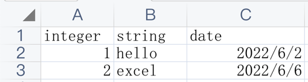

# 概述

基于 easyexcel 实现的 spring-boot-starter, 支持 Web 环境下通过 `@ExcelParam` 及 `@ExcelResponse` 注解导入和导出
Excel，支持导入时的参数校验，适用于比较简单的导入导出场景。

# 依赖引入

依赖暂未上传至中央仓库，请自行打包上传到私有仓库。

```xml

<dependency>
    <groupId>com.zzuhkp</groupId>
    <artifactId>easyexcel-spring-boot-starter</artifactId>
    <version>1.0-SNAPSHOT</version>
</dependency>
```

# 导入

## 1. 待导入 Excel 文件

文件内容如下：



## 2. 定义 Model 类

定义 Excel 文件内容对应的 Model 类，可使用 easyexcel 注解定义映射关系。

```java

@Data
public class DemoData {

    @ExcelProperty(index = 0)
    private Integer integer;

    @ExcelProperty(index = 1)
    private String string;

    @ExcelProperty(index = 2)
    private Date date;
}
```

## 3. controller 方法参数定义

支持 `List<T>` 及 `ReadRows<T>` 两种类型的参数，在方法参数上添加 `@ExcelParam` 注解即可。

```java
@PostMapping("/list/obj")
public List<DemoData> listObj(@ExcelParam List<DemoData> list){
    return list;
}
```

```java
@PostMapping("/list/rows")
public ReadRows<DemoData> readRows(@ExcelParam(value = "file") ReadRows<DemoData> readRows){
    return readRows;
}
```

`@ExcelParam` 注解用于指定一些参数信息，类似于 `@RequestParam` 参数，定义如下。

```java
public @interface ExcelParam {

    // 字段名称
    String value() default "file";

    // 是否必须
    boolean required() default true;
}
```

`ReadRows` 包含了一些关于行列的附加信息，例如解析出的对象对应哪一行数据、对象字段对应哪一列数据。定义如下：

```java
public class ReadRows<T> {

    // 头信息元数据，包括列信息
    private ExcelReadHeadProperty excelReadHeadProperty;

    // 行信息
    private List<ReadRow<T>> rows;
}

public class ReadRow<T> {

    // 行索引，从 0 开始
    private final Integer rowIndex;

    // 行数据
    private final T data;
}  
```

# 导出

将 controller 方法返回值定义为 `List<T>` 类型，然后添加 `@ExcelResponse` 注解即可。

```java
@ExcelResponse
@GetMapping("/list/download")
public List<DemoData> downloadList() {
        return Arrays.asList(new DemoData(1, "hello", new Date()), new DemoData(2, "excel", new Date()));
}
```

`@ExcelResponse` 注解用于定义一些导出的元数据，定义如下：

```java
public @interface ExcelResponse {

    // 文件名称，不包含后缀
    String fileName() default "default";

    // sheet 名称
    String sheetName() default "Sheet1";
}
```

# 参数校验

参数校验是 Excel 导入常用的功能，看到其他人写过类似的项目，但是对参数校验的支持不是很友好，这里提供了更友好的校验功能，如 spring boot 原生校验般丝滑。

## 1. 开启校验

在 `List<T>` 或 `ReadRows<T>` 类型的 controller 方法参数上添加 `@Validated` 或 `@Valid` 注解即可。示例如下：

```java
@PostMapping("/list/obj")
public List<DemoData> listObj(@ExcelParam @Validated List<DemoData> list){
        return list;
}
```

## 2. 定义校验规则

有两种方式定义校验规则。

### 2.1 JSR 303 规范校验

通过 JSR 303 规范定义的校验注解配置校验规则，需要引入 `spring-boot-starter-validation`。

这是默认的校验方式，可通过设置环境变量 `easyexcel.validator.default.enable=false` 关闭。

示例如下：

```java

@Data
public class DemoData {

    @NotNull(message = "数值不能为空")
    private Integer integer;

    @NotBlank(message = "字符串不能为空")
    private String string;

    private Date date;
}
```

还可以对整个对象校验。

```java

@Data
@DemoDataValid
public class DemoData {

    private Integer integer;

    private String string;

    private Date date;
}

@Documented
@Target({TYPE})
@Retention(RUNTIME)
@Constraint(validatedBy = {DemoDataValid.DemoDataValidator.class})
public @interface DemoDataValid {

    String message() default "{com.zzuhkp.easyexcel.validator.DemoDataValid.message}";

    Class<?>[] groups() default {};

    Class<? extends Payload>[] payload() default {};

    class DemoDataValidator implements ConstraintValidator<DemoDataValid, DemoData> {

        @Override
        public boolean isValid(DemoData value, ConstraintValidatorContext context) {
            context.disableDefaultConstraintViolation();
            context.buildConstraintViolationWithTemplate("测试对象校验").addConstraintViolation();
            return false;
        }
    }

}
```

### 2.2 ExcelValidator 接口校验

JSR 303 规范只能校验单个对象或者字段，如果想要对导入所有对象进行校验可以使用框架定义的 `ExcelValidator` 接口，实现接口，并将实现类定义为 bean 即可，接口定义如下。

```java
public interface ExcelValidator<T> {

    // 参数校验
    ExcelValidErrors validate(ReadRows<T> readRows);
}
```

`ExcelValidErrors` 作为校验的结果，包含了多个错误信息。

```java
public class ExcelValidErrors {

    private final List<ExcelValidObjectError> errors;
}
```

错误信息又可以分为行错误信息与单元格错误信息，分别对应对象错误信息和字段错误信息。

行错误信息使用 `ExcelValidObjectError` 接口表示，接口定义如下：

```java
public interface ExcelValidObjectError {

    // 获取行号，从 1 开始
    Integer getRow();

    // 获取错误消息
    String getMessage();
}
```

单元格错误信息使用 `ExcelValidFieldError` 表示，接口定义如下：

```java
public interface ExcelValidFieldError extends ExcelValidObjectError {

    // 获取列，从 1 开始
    Integer getColumn();
}
```
如果默认实现不满足要求可自行提供实现。

例如，如果想校验上述导入示例中的 `integer` 列的值不能重复，可以使用如下的代码。
```java
@Component
public class CustomExcelValidator implements ExcelValidator<DemoData> {
    @Override
    public ExcelValidErrors validate(ReadRows<DemoData> readRows) {
        ExcelValidErrors errors = new ExcelValidErrors();

        Map<Integer, List<ReadRow<DemoData>>> group = readRows.getRows().stream()
                .collect(Collectors.groupingBy(item -> item.getData().getInteger()));

        for (Map.Entry<Integer, List<ReadRow<DemoData>>> entry : group.entrySet()) {
            if (entry.getValue().size() > 1) {
                for (ReadRow<DemoData> readRow : entry.getValue()) {
                    errors.addError(new DefaultExcelObjectError(readRow.getRowIndex() + 1, "参数重复"));
                }
            }
        }
        return errors;
    }
}
```

## 3. 校验结果接收

校验结果同样有两种方式接收。

## 3.1 异常捕获接收

默认情况下，添加 `@Validated` 或 `@Valid` 注解开启校验功能后，框架会将校验结果封装为 `ExcelValidException` 异常，可以使用 `ControllerAdvice` 进行全局异常捕获获取校验结果。

```java
@RestControllerAdvice
public class GlobalExceptionControllerAdvice {

    @ExceptionHandler(Exception.class)
    public String handleException(ExcelValidException e) {
        ExcelValidErrors errors = e.getErrors();
        return JSON.toJSONString(errors);
    }
}
```

## 3.2 ExcelValidErrors 类型参数接收

如果不想通过异常捕获的方式接收校验结果，可以将 `ExcelValidErrors` 类型的参数定义到 `@ExcelParam` 参数后。示例代码如下：

```java
@PostMapping("/list/obj")
public List<DemoData> listObj(@ExcelParam @Validated List<DemoData> list, ExcelValidErrors errors) {
    if (errors.hasErrors()) {
        String messages = errors.getAllErrors().stream().map(ExcelValidObjectError::getMessage).collect(Collectors.joining(" | "));
        throw new RuntimeException("发现异常:" + messages);
    }
    return list;
}
```

# 其他说明

如果你在使用过程中遇到任何问题，可以随时提 issue 反映。